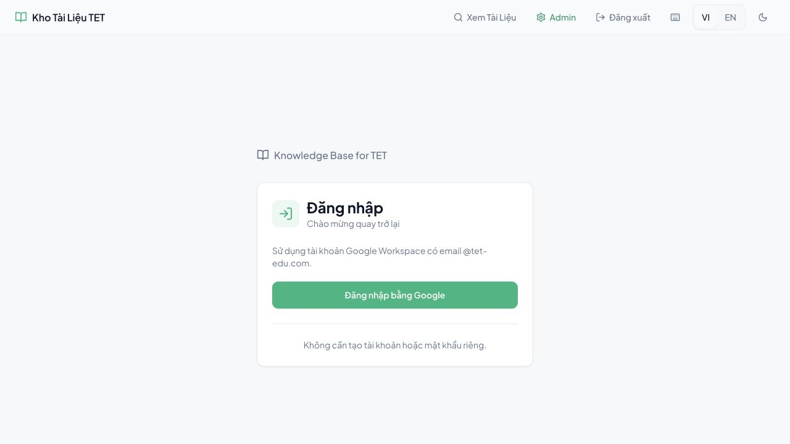
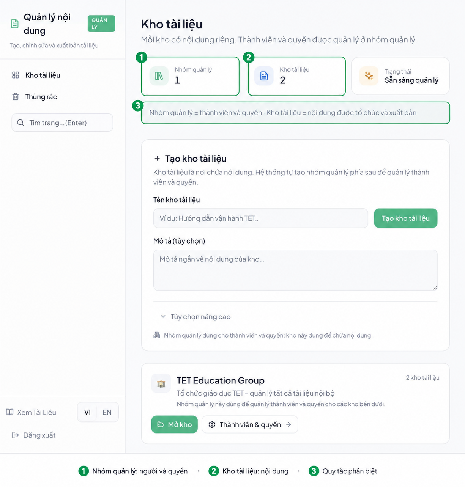
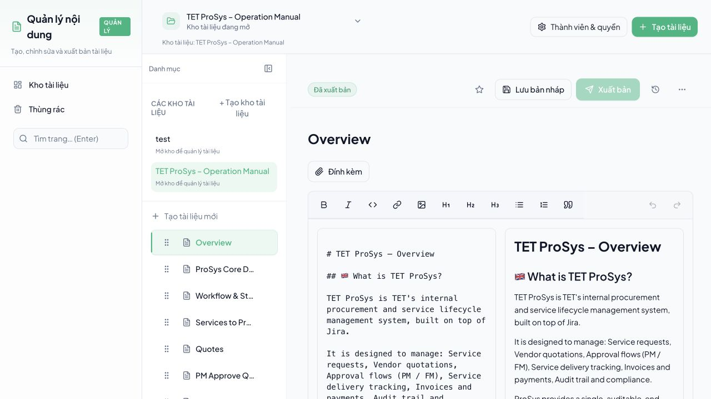
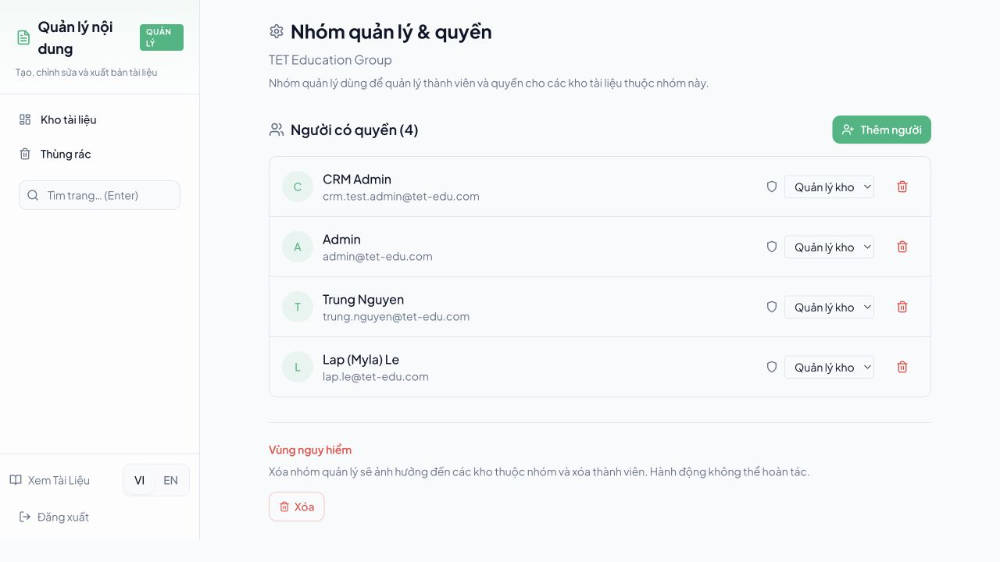
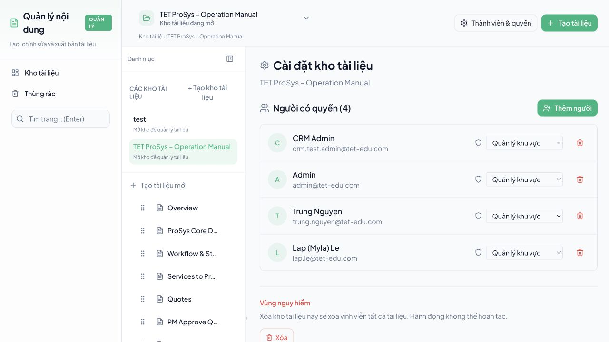
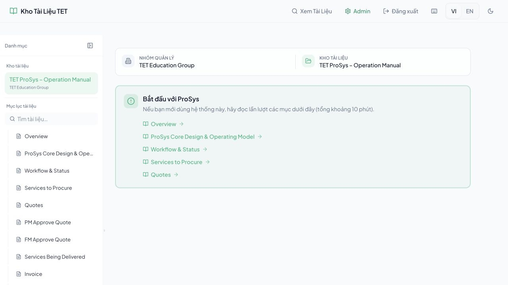
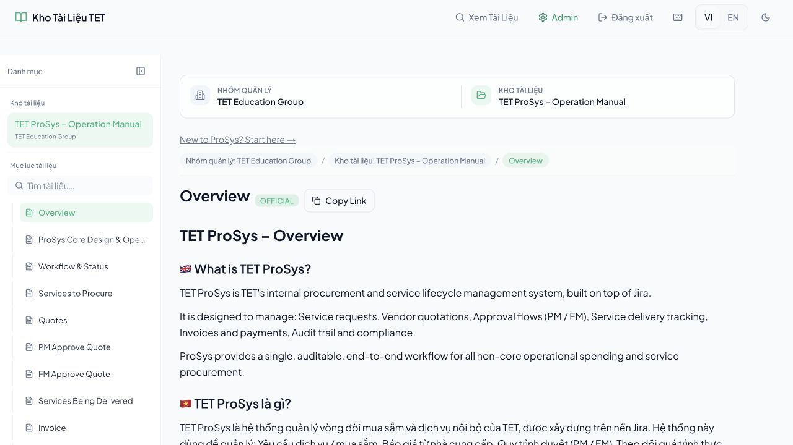

# SOP sử dụng Kho Tài Liệu TET

> Tài liệu hướng dẫn chuẩn cho người không rành kỹ thuật. Làm theo đúng thứ tự từ trên xuống dưới để tạo, quản lý, xuất bản và chia sẻ tài liệu mà không bị nhầm giữa Nhóm quản lý, Kho tài liệu và Trang tài liệu.

**Phiên bản:** 1.0
**Cập nhật:** 08/08/2026
**Môi trường tham chiếu:** [kb.tet-edu.com](https://kb.tet-edu.com)
**Phạm vi:** Knowledge Base. Không áp dụng cho CRM tại `crm.tet-edu.com`.

## Mục lục

1. [Hiểu đúng ba lớp của hệ thống](#1-hiểu-đúng-ba-lớp-của-hệ-thống)
2. [Flow chuẩn từ lúc đăng nhập đến lúc bàn giao](#2-flow-chuẩn-từ-lúc-đăng-nhập-đến-lúc-bàn-giao)
3. [Chuẩn bị trước khi tạo nội dung](#3-chuẩn-bị-trước-khi-tạo-nội-dung)
4. [Đăng nhập](#4-đăng-nhập)
5. [Tạo và phân biệt Kho tài liệu](#5-tạo-và-phân-biệt-kho-tài-liệu)
6. [Tạo Trang tài liệu và mục lục](#6-tạo-trang-tài-liệu-và-mục-lục)
7. [Soạn nội dung](#7-soạn-nội-dung)
8. [Lưu bản nháp và xuất bản](#8-lưu-bản-nháp-và-xuất-bản)
9. [Thiết lập Nhóm quản lý và quyền ở Kho](#9-thiết-lập-nhóm-quản-lý-và-quyền-ở-kho)
10. [Xem tài liệu như người đọc](#10-xem-tài-liệu-như-người-đọc)
11. [Nhiều Kho tài liệu và cách tránh nhầm](#11-nhiều-kho-tài-liệu-và-cách-tránh-nhầm)
12. [Thùng rác và phục hồi](#12-thùng-rác-và-phục-hồi)
13. [Xử lý lỗi thường gặp](#13-xử-lý-lỗi-thường-gặp)
14. [Checklist bàn giao](#14-checklist-bàn-giao)

## 1. Hiểu đúng ba lớp của hệ thống

Đây là phần quan trọng nhất. Nếu chọn nhầm tầng, bạn sẽ tạo sai nơi hoặc cấp quyền sai người.

| Tầng | Tên hiển thị | Dùng để làm gì? | Ví dụ |
|---|---|---|---|
| 1 | **Nhóm quản lý** | Nhóm sở hữu và quản lý thành viên, quyền truy cập cho các Kho | `TET Education Group` |
| 2 | **Kho tài liệu** | Một bộ tài liệu theo chủ đề, dự án hoặc phòng ban | `TET ProSys - Operation Manual` |
| 3 | **Trang tài liệu** | Một bài viết cụ thể trong Kho; các trang tạo thành mục lục | `Overview`, `Workflow & Status` |

### Cách hình dung đơn giản

```text
Nhóm quản lý: TET Education Group
└── Kho tài liệu: TET ProSys - Operation Manual
    ├── Trang: Overview
    ├── Trang: Workflow & Status
    └── Trang: Quotes
```

### Quy tắc chọn đúng tầng

- Muốn thêm người hoặc đổi quyền cho toàn bộ nhóm: vào **Nhóm quản lý**.
- Muốn tạo một bộ nội dung mới: tạo **Kho tài liệu**.
- Muốn thêm một bài viết vào bộ nội dung đang có: tạo **Trang tài liệu**.
- Muốn người khác đọc: mở **Xem Tài liệu**, không vào màn hình quản trị.
- Từ `Kho tài liệu` không có nghĩa là `Nhóm quản lý`. Kho là nội dung; Nhóm là phạm vi quản trị.

## 2. Flow chuẩn từ lúc đăng nhập đến lúc bàn giao

Làm theo flow này cho mỗi bộ tài liệu mới:

```text
1. Đăng nhập bằng Google Workspace @tet-edu.com
       |
2. Kiểm tra đang ở đúng Nhóm quản lý
       |
3. Tạo hoặc chọn đúng Kho tài liệu
       |
4. Tạo Trang đầu tiên và các Trang con
       |
5. Soạn nội dung theo mẫu thống nhất
       |
6. Lưu bản nháp, kiểm tra preview, rồi Xuất bản
       |
7. Mở Xem Tài liệu để kiểm tra mục lục, breadcrumb và nội dung
       |
8. Cấp quyền đúng phạm vi và bàn giao link
```

**Nguyên tắc giảm thao tác thủ công:** tạo một Kho rõ ràng ngay từ đầu, tạo Trang đầu tiên làm trang điều hướng, dùng cấu trúc Trang con thay vì gom mọi thứ vào một bài dài, và luôn kiểm tra ở chế độ người đọc trước khi gửi link.

## 3. Chuẩn bị trước khi tạo nội dung

Trước khi bấm **Tạo kho tài liệu**, thống nhất 4 thông tin:

1. Tên Nhóm quản lý sở hữu nội dung.
2. Tên Kho tài liệu.
3. Danh sách Trang cấp đầu và Trang con.
4. Người có quyền `Quản lý kho` và người chỉ cần `Được chỉnh sửa` hoặc `Chỉ xem`.

### Chuẩn đặt tên khuyến nghị

| Đối tượng | Mẫu tên | Ví dụ tốt |
|---|---|---|
| Nhóm quản lý | Tên pháp nhân hoặc tổ chức | `TET Education Group` |
| Kho tài liệu | `[Chủ đề] - [Phạm vi hoặc năm]` | `TET ProSys - Operation Manual` |
| Trang tài liệu | Tên tác vụ hoặc chủ đề cụ thể | `Workflow & Status` |
| Trang tổng quan | `Overview` hoặc `Bắt đầu tại đây` | `Overview` |

Không nên đặt nhiều Kho có tên gần giống nhau như `TET`, `TET 2`, `TET new`. Nếu cần bản mới, thêm chủ đề hoặc năm vào tên để người đọc biết ngay đang ở đâu.

## 4. Đăng nhập

**Địa chỉ:** [https://kb.tet-edu.com/login](https://kb.tet-edu.com/login)



### Các bước

1. Mở link đăng nhập.
2. Bấm **Đăng nhập bằng Google**.
3. Chọn đúng tài khoản Google Workspace có đuôi `@tet-edu.com`.
4. Nếu Google hỏi xác nhận, chấp thuận để quay lại Knowledge Base.
5. Kiểm tra thanh điều hướng đã hiện **Admin** nếu bạn có quyền quản trị.

**Kết quả mong đợi:** bạn quay về Knowledge Base, không quay sang `crm.tet-edu.com`. Nếu quay sai trang, xem [Xử lý lỗi thường gặp](#13-xử-lý-lỗi-thường-gặp).

**Lưu ý an toàn:** không dùng mật khẩu riêng của Knowledge Base. Hệ thống dùng Google Workspace; người dùng không cần tự đăng ký tài khoản hoặc tạo mật khẩu mới.

## 5. Tạo và phân biệt Kho tài liệu

### 5.1. Mở màn hình quản lý Kho

Sau khi đăng nhập, bấm **Admin** trên thanh trên cùng rồi chọn **Kho tài liệu**.



Màn hình này là nơi tạo và chọn Kho. Các ô thống kê phía trên chỉ là thông tin tổng quan; không phải các cấp phân quyền.

### 5.2. Tạo Kho mới

1. Tại thẻ **Tạo kho tài liệu**, nhập tên Kho.
2. Nhập mô tả ngắn để người khác nhận biết phạm vi nội dung.
3. Chỉ mở **Tùy chọn nâng cao** khi bạn thực sự cần đường dẫn hoặc cài đặt kỹ thuật.
4. Bấm **Tạo kho** một lần.
5. Chờ thẻ Kho mới xuất hiện trong danh sách.
6. Bấm **Mở kho** để bắt đầu tạo Trang.

**Kết quả mong đợi:** một Kho mới xuất hiện dưới đúng Nhóm quản lý; hệ thống tự tạo khu vực nội dung đầu tiên để bạn không phải dựng cấu trúc kỹ thuật thủ công.

### 5.3. Chọn Kho đã có

Nếu Kho đã tồn tại, không tạo thêm Kho trùng tên. Hãy tìm thẻ Kho trong danh sách, kiểm tra dòng mô tả và Nhóm quản lý, sau đó bấm **Mở kho**.

### 5.4. Phân biệt nhanh

- **Nhóm quản lý**: thấy tên tổ chức và mục **Người có quyền**.
- **Kho tài liệu**: thấy tên Kho, nút **Mở kho**, nút **Người & quyền**.
- **Trang tài liệu**: thấy tiêu đề bài viết, thanh soạn thảo, **Lưu bản nháp** và **Xuất bản**.

## 6. Tạo Trang tài liệu và mục lục

### 6.1. Tạo Trang cấp đầu

Trong Kho, bấm **Tạo tài liệu mới**. Dùng Trang cấp đầu cho các nhóm nội dung lớn, ví dụ:

- `Overview`
- `Workflow & Status`
- `Services to Procure`
- `Quotes`



**Kết quả mong đợi:** Trang mới xuất hiện trong cột **Danh mục** ở bên trái và có thể mở để soạn nội dung.

### 6.2. Tạo Trang con

Tách một chủ đề dài thành Trang con khi:

- Một bài có nhiều quy trình khác nhau.
- Người đọc cần link trực tiếp đến từng tác vụ.
- Mục lục bắt đầu quá dài.

Đặt tên theo tác vụ, không đặt tên chung chung. Ví dụ `PM Approve Quote` rõ hơn `Page 2`.

### 6.3. Đổi thứ tự Trang

1. Tìm biểu tượng kéo ở bên trái tiêu đề Trang.
2. Kéo Trang lên hoặc xuống theo thứ tự người đọc cần.
3. Kiểm tra lại ở **Xem Tài liệu**.

**Kết quả mong đợi:** mục lục của Kho đi theo trình tự đọc; Trang tổng quan nằm trước các Trang chi tiết.

### 6.4. Cấu trúc mục lục khuyến nghị

```text
Overview
├── Bối cảnh và mục tiêu
├── Workflow & Status
│   ├── Các trạng thái
│   └── Quy tắc chuyển trạng thái
├── Services to Procure
└── Quotes
```

## 7. Soạn nội dung


### 7.1. Các nút trong thanh soạn thảo

| Nút | Công dụng | Khi nên dùng |
|---|---|---|
| **B** | In đậm | Từ khóa, điều kiện quan trọng |
| *I* | In nghiêng | Thuật ngữ hoặc chú thích |
| `<>` | Code | Tên trường, mã, URL kỹ thuật |
| Biểu tượng link | Chèn liên kết | Link đến tài liệu liên quan |
| Biểu tượng ảnh | Chèn hình ảnh | Screenshot, sơ đồ, ví dụ |
| H1, H2, H3 | Tạo cấp tiêu đề | Chia nội dung thành phần rõ ràng |
| Danh sách | Bullet hoặc đánh số | Checklist và các bước |
| Dấu ngoặc kép | Trích dẫn hoặc lưu ý | Quy định, cảnh báo |
| Mũi tên cong | Hoàn tác hoặc làm lại | Sửa nhanh thao tác gần nhất |

### 7.2. Mẫu bài viết chuẩn

Mỗi Trang nên có cấu trúc dưới đây:

```markdown
# Tên tài liệu

## Mục đích
Trang này giúp người dùng làm được việc gì?

## Khi nào sử dụng
Điều kiện hoặc trường hợp áp dụng.

## Các bước
1. Bước đầu tiên.
2. Bước tiếp theo.
3. Kiểm tra kết quả.

## Kết quả mong đợi
Người dùng nhìn thấy gì sau khi hoàn thành?

## Lưu ý hoặc lỗi thường gặp
Các trường hợp cần tránh.
```

### 7.3. Quy tắc viết cho người không rành kỹ thuật

- Mỗi bước chỉ nên có một hành động chính.
- Dùng tên nút đúng như giao diện, đặt trong dấu **đậm**.
- Luôn nói rõ người dùng đang ở Nhóm, Kho hay Trang.
- Sau mỗi nhóm bước, ghi **Kết quả mong đợi**.
- Không đưa `slug`, UUID, schema hoặc API vào flow người dùng thông thường.
- Khi cần gửi link, lấy link từ **Copy Link** hoặc từ thanh địa chỉ sau khi đã kiểm tra đúng Trang.

### 7.4. Hình ảnh và tệp đính kèm

- Chỉ chèn ảnh giúp người đọc hiểu thao tác hoặc kết quả.
- Cắt ảnh ở mức vừa đủ để thấy nút cần bấm và vùng liên quan.
- Đặt chú thích dưới ảnh: `Hình X - [màn hình] - [ý nghĩa]`.
- Không chèn mật khẩu, mã xác thực, secret key hoặc thông tin cá nhân không cần thiết.

## 8. Lưu bản nháp và xuất bản

### 8.1. Soạn và lưu bản nháp

1. Nhập hoặc dán nội dung vào editor.
2. Kiểm tra tiêu đề, heading, danh sách và link.
3. Bấm **Lưu bản nháp**.
4. Chờ trạng thái cập nhật.

**Lưu bản nháp** chỉ lưu nội dung để tiếp tục chỉnh sửa; người đọc public chưa nên xem đó là phiên bản chính thức.

### 8.2. Xuất bản

1. Đọc lại toàn bộ nội dung trong vùng preview.
2. Kiểm tra không còn chữ nháp, link hỏng hoặc tiêu đề tạm.
3. Bấm **Xuất bản**.
4. Xác nhận trạng thái chuyển thành **Đã xuất bản** hoặc **Official**.
5. Mở **Xem Tài liệu** ở tab mới để kiểm tra như người đọc.


### 8.3. Khi nào không nên xuất bản?

- Nội dung còn thiếu phần kết quả mong đợi.
- Mục lục chưa đúng thứ tự.
- Link đang trỏ vào bản nháp hoặc sai Kho.
- Chưa kiểm tra quyền người đọc.
- Đang sửa tài liệu cũ nhưng chưa thống nhất người duyệt.

## 9. Thiết lập Nhóm quản lý và quyền ở Kho

### 9.1. Quyền ở Nhóm quản lý

Vào **Admin > Nhóm quản lý** hoặc mở phần **Nhóm quản lý & quyền**. Màn hình này quản lý người và quyền dùng cho các Kho thuộc Nhóm.



Các vai trò nên hiểu như sau:

- **Quản lý kho**: được quản lý Kho, thành viên và nội dung trong phạm vi được cấp.
- **Được chỉnh sửa**: được sửa nội dung nhưng không nên tự thay đổi phạm vi quản trị nếu không cần.
- **Chỉ xem**: chỉ đọc nội dung đã được phép xem.

### 9.2. Quyền trực tiếp ở Kho

Vào Kho cụ thể, bấm **Thành viên & quyền**. Đây là nơi giới hạn quyền cho một Kho, không phải toàn bộ Nhóm.



### 9.3. Cách cấp quyền an toàn

1. Cấp ở Nhóm quản lý khi người đó cần quản lý nhiều Kho.
2. Cấp trực tiếp ở Kho khi người đó chỉ làm việc với một Kho.
3. Dùng quyền thấp nhất đủ để hoàn thành công việc.
4. Sau khi thêm người, kiểm tra lại danh sách và vai trò.
5. Không xóa Nhóm quản lý nếu chưa kiểm tra cảnh báo vùng nguy hiểm.

## 10. Xem tài liệu như người đọc

### 10.1. Trang Kho



Ở phía trên có hai thông tin quan trọng:

- **Nhóm quản lý:** cho biết nội dung thuộc tổ chức nào.
- **Kho tài liệu:** cho biết đang đọc bộ nội dung nào.

Ở cột trái là **Mục lục tài liệu**. Đây là danh sách Trang trong Kho, không phải danh sách Nhóm quản lý.

### 10.2. Trang bài viết



Kiểm tra theo thứ tự:

1. Breadcrumb có đúng Nhóm quản lý không?
2. Breadcrumb có đúng Kho tài liệu không?
3. Tên Trang hiện tại có đúng không?
4. Trang đang chọn có được đánh dấu trong mục lục không?
5. Nội dung, hình ảnh và link có hiển thị đúng không?

### 10.3. Link bàn giao

Chỉ gửi link sau khi mở link ở cửa sổ mới và kiểm tra đúng ba lớp. Nếu người nhận chỉ cần đọc, gửi link **Xem Tài liệu**, không gửi link `/admin`.

## 11. Nhiều Kho tài liệu và cách tránh nhầm

Khi có nhiều Kho, người dùng thường nhầm vì tên Kho hoặc Trang giống nhau. Dùng quy tắc sau:

- Mỗi Kho có một tên chủ đề duy nhất.
- Mỗi Kho có một Trang `Overview` làm điểm bắt đầu.
- Mô tả Kho ghi rõ đối tượng sử dụng và phạm vi nội dung.
- Không dùng cùng một tên Trang để đại diện cho hai quy trình khác nhau nếu có thể đặt tên cụ thể hơn.
- Khi tạo link, luôn nhìn breadcrumb trước khi copy.
- Với nhóm nội dung lớn, tách thành Kho riêng thay vì tạo quá nhiều tầng Trang.

### Quyết định nhanh: tạo Kho hay tạo Trang?

| Câu hỏi | Trả lời | Hành động |
|---|---|---|
| Nội dung có cùng chủ đề và cùng nhóm người dùng không? | Có | Tạo Trang trong Kho hiện tại |
| Nội dung thuộc chủ đề hoặc phòng ban khác hẳn? | Có | Tạo Kho mới |
| Chỉ cần thêm một quy trình trong bộ hiện tại? | Có | Tạo Trang hoặc Trang con |
| Người mới không biết bắt đầu từ đâu? | Có | Tạo hoặc cập nhật Trang `Overview` |

## 12. Thùng rác và phục hồi

Khi không thấy Trang hoặc Kho:

1. Kiểm tra bạn đang chọn đúng Nhóm quản lý.
2. Kiểm tra đang ở đúng Kho.
3. Mở **Thùng rác** trong Admin.
4. Tìm theo tên Trang hoặc Kho.
5. Chỉ phục hồi khi đã xác nhận đúng đối tượng.

Không xóa hàng loạt để xử lý nhanh. Các thao tác xóa vùng nguy hiểm có thể không hoàn tác.

## 13. Xử lý lỗi thường gặp

### Bấm Google nhưng quay lại đăng nhập

1. Đảm bảo đang dùng tài khoản `@tet-edu.com`.
2. Đóng tab Google đang dở và mở lại từ `kb.tet-edu.com/login`.
3. Không dùng link callback cũ hoặc link có `code=` đã hết hạn.
4. Nếu vẫn lỗi, chụp URL lỗi và thời điểm xảy ra để kiểm tra cấu hình OAuth.

### Đăng nhập xong lại nhảy sang CRM

Đây là dấu hiệu callback đang trỏ sai ứng dụng. Không tiếp tục bấm lại nhiều lần vì mã OAuth chỉ dùng một lần. Quay lại `https://kb.tet-edu.com/login`, thử một phiên đăng nhập mới. Nếu còn lặp lại, báo đúng URL đích và không thay đổi cấu hình CRM.

### Thấy `State has already been used`

Tab Google callback cũ đã được dùng hoặc bị mở lại. Đóng tab lỗi, mở lại trang login của Knowledge Base và bắt đầu một flow mới.

### Không thấy Kho hoặc Trang

- Kiểm tra đúng Nhóm quản lý.
- Kiểm tra vai trò của tài khoản.
- Kiểm tra Kho có bị xóa vào Thùng rác không.
- Tải lại một lần; nếu vẫn lỗi, không tạo thêm bản trùng.

### Thấy `Failed to fetch` hoặc `Không thể tải dữ liệu`

1. Tải lại trang một lần.
2. Kiểm tra mạng.
3. Nếu đang ở Admin, kiểm tra session Google còn hiệu lực.
4. Không bấm nút tạo nhiều lần.
5. Nếu lỗi chỉ xảy ra ở một màn hình, chụp màn hình kèm URL để truy vết.

### Đã xuất bản nhưng người đọc chưa thấy

- Kiểm tra trạng thái Trang là **Đã xuất bản**.
- Mở URL public ở tab mới.
- Kiểm tra đúng Kho và đúng Trang trong breadcrumb.
- Tải lại bằng cửa sổ mới để tránh xem dữ liệu cũ.

## 14. Checklist bàn giao

### Checklist cho người tạo nội dung

- [ ] Đã đăng nhập đúng tài khoản `@tet-edu.com`.
- [ ] Đã chọn đúng Nhóm quản lý.
- [ ] Đã chọn Kho hiện có hoặc tạo Kho với tên không trùng.
- [ ] Đã có Trang `Overview`.
- [ ] Mục lục được sắp xếp theo thứ tự đọc.
- [ ] Mỗi Trang có mục đích, các bước và kết quả mong đợi.
- [ ] Hình ảnh rõ, không lộ thông tin nhạy cảm.
- [ ] Đã lưu bản nháp trước khi xuất bản.
- [ ] Đã kiểm tra preview và trạng thái xuất bản.
- [ ] Đã mở link public và kiểm tra như người đọc.

### Checklist cho người cấp quyền

- [ ] Người nhận có đúng email.
- [ ] Quyền được cấp ở đúng tầng: Nhóm hoặc Kho.
- [ ] Không cấp quyền quản lý nếu chỉ cần đọc hoặc sửa.
- [ ] Đã kiểm tra lại danh sách sau khi lưu.
- [ ] Không xóa Nhóm hoặc Kho khi chưa có xác nhận.

### Checklist cho người nhận link

- [ ] Link mở đúng `kb.tet-edu.com`.
- [ ] Header cho biết đúng Nhóm quản lý.
- [ ] Header cho biết đúng Kho tài liệu.
- [ ] Mục lục bên trái có đúng các Trang cần đọc.
- [ ] Trang đang mở có đúng tiêu đề và trạng thái chính thức.

## Tóm tắt một câu

**Nhóm quản lý là nơi quản người và quyền; Kho tài liệu là nơi gom một bộ nội dung; Trang tài liệu là từng bài viết; luôn xuất bản xong rồi kiểm tra lại ở Xem Tài liệu trước khi bàn giao.**
