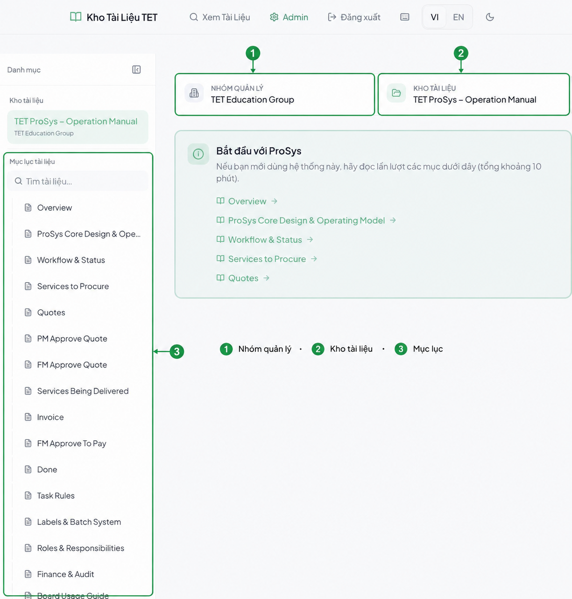
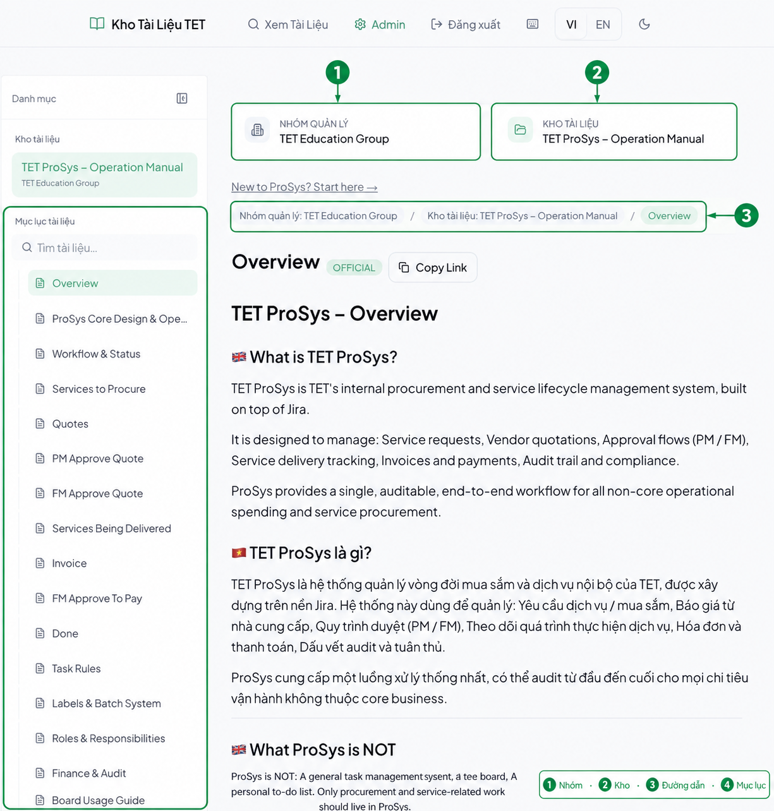
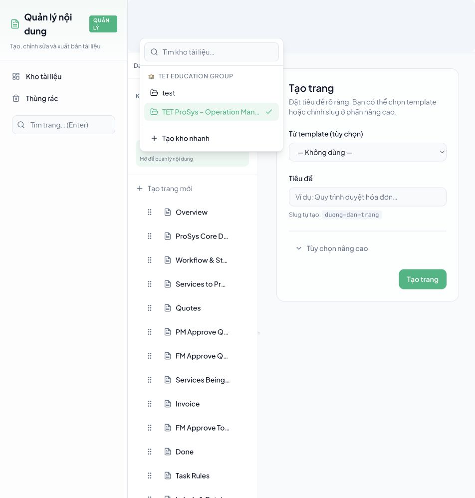
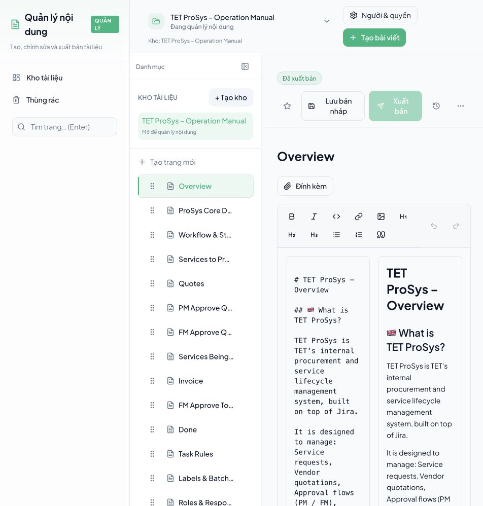

# Hướng dẫn sử dụng Kho Tài Liệu TET

> Tài liệu này dành cho người không chuyên kỹ thuật. Bạn chỉ cần biết cách đăng nhập Google, đặt tên rõ ràng và viết nội dung; hệ thống tự xử lý đường dẫn, cấu trúc dữ liệu và việc hiển thị bản public.

## 1. Hiểu đúng ba lớp của hệ thống

Điểm dễ nhầm nhất là **Nhóm quản lý**, **Kho tài liệu** và **Tài liệu** không phải là ba tên gọi khác nhau của cùng một thứ. Chúng nằm ở ba tầng khác nhau:

| Tầng | Tên người dùng nhìn thấy | Dùng để làm gì? | Ví dụ |
|---|---|---|---|
| 1 | **Nhóm quản lý** | Quản lý thành viên và quyền. Đây là phạm vi quản trị, không phải nơi viết nội dung. | TET Education Group |
| 2 | **Kho tài liệu** | Một bộ nội dung có chủ đề, đối tượng đọc và phạm vi xuất bản riêng. | TET ProSys – Operation Manual |
| 3 | **Tài liệu** | Một nội dung cụ thể trong kho; có thể có tài liệu con. | Overview, Workflow & Status |

### Cách hình dung đơn giản

- **Nhóm quản lý** giống như một đội hoặc công ty.
- **Kho tài liệu** giống như một tủ sách của đội đó.
- **Tài liệu** giống như một cuốn sách hoặc một mục trong tủ sách.

Một nhóm quản lý có thể có nhiều kho tài liệu. Một kho tài liệu có thể có nhiều tài liệu. Nếu bạn chỉ có một nhóm quản lý, bạn không cần vào phần nhóm thường xuyên; hãy làm việc ở kho tài liệu.

### Quy tắc chọn đúng tầng

- Muốn thêm người hoặc đổi quyền của người đó ở nhiều kho: vào **Thành viên & quyền** của **Nhóm quản lý**.
- Muốn thêm một bộ nội dung mới, có đối tượng đọc hoặc mục đích xuất bản khác: tạo **Kho tài liệu** mới.
- Muốn thêm một chủ đề, quy trình hoặc bài hướng dẫn trong cùng bộ nội dung: tạo **Tài liệu** mới.
- Muốn chia một tài liệu thành các phần rõ ràng: tạo **Tài liệu con**.

> Không tạo kho mới chỉ vì một chủ đề nhỏ. Ví dụ Invoice nên là một tài liệu trong kho vận hành, không nên trở thành một kho riêng nếu cùng người đọc và cùng phạm vi quản lý.

## 2. Đăng nhập

1. Mở địa chỉ Knowledge Base của TET.
2. Chọn **Đăng nhập bằng Google**.
3. Chọn tài khoản Google Workspace có email @tet-edu.com.
4. Nếu Google hỏi lại mật khẩu, hãy nhập mật khẩu của tài khoản Google Workspace; đây không phải mật khẩu riêng của Knowledge Base.
5. Sau khi đăng nhập:
   - **Xem Tài Liệu**: đọc nội dung đã xuất bản.
   - **Quản lý**: tạo, sửa, sắp xếp và xuất bản nội dung nếu tài khoản có quyền.

Không tạo tài khoản/mật khẩu riêng cho Knowledge Base. Nếu trình duyệt đang giữ nhiều tài khoản Google, chọn đúng tài khoản TET trước khi bấm tiếp tục.

## 3. Tạo kho tài liệu đầu tiên

### Khi nào cần tạo kho mới?

Chỉ tạo kho mới khi ít nhất một điều sau khác với kho hiện tại:

- Người đọc hoặc nhóm chịu trách nhiệm khác.
- Bộ tài liệu cần xuất bản tại một mục riêng.
- Quyền truy cập cần khác.
- Nội dung là một sản phẩm hoặc quy trình độc lập, không nên nằm cùng mục lục.

Ví dụ phù hợp:

- TET ProSys – Operation Manual: tài liệu vận hành ProSys.
- TET HR Handbook: hướng dẫn nhân sự, người đọc và người quản lý khác.
- TET Sales Playbook: tài liệu bán hàng, có phạm vi riêng.

Ví dụ không nên tách thành kho mới:

- Invoice trong cùng quy trình ProSys.
- Quotes trong cùng một bộ hướng dẫn.
- Một phiên bản nhỏ của cùng quy trình.

### Các bước

1. Vào **Quản lý** → **Kho tài liệu**.
2. Ở thẻ **Tạo kho tài liệu**, nhập tên dễ hiểu, ví dụ TET HR Handbook.
3. Có thể thêm mô tả ngắn: kho này dùng cho ai và chứa nội dung gì.
4. Bấm **Tạo kho tài liệu**.
5. Hệ thống tự tạo phần quản lý phía sau và mở kho mới. Bạn không cần tự tạo organization, schema, slug hoặc URL.

### Tên kho nên đặt thế nào?

Nên dùng mẫu:

[Đơn vị hoặc sản phẩm] – [mục đích của bộ tài liệu]

Tên tốt:

- TET ProSys – Operation Manual
- TET Finance – Approval Guide
- TET HR – Staff Handbook

Tên khó phân biệt:

- Test
- New
- Docs 2
- Kho mới

Tên kho là thứ người đọc nhìn thấy trong mục chọn kho, vì vậy không dùng tên kỹ thuật hoặc chỉ dùng mã nội bộ.

## 4. Nhiều kho khác nhau như thế nào?

Trong màn hình quản lý, các kho có thể nằm dưới cùng một **Nhóm quản lý**. Điều đó nghĩa là nhóm có thể quản lý thành viên chung, nhưng nội dung vẫn tách biệt.

| Tình huống | Nên làm |
|---|---|
| Cùng nhóm người đọc, cùng chủ đề lớn | Dùng cùng một kho, tạo thêm tài liệu hoặc tài liệu con |
| Khác nhóm người đọc | Tạo kho riêng hoặc đặt quyền riêng cho kho |
| Khác chủ sở hữu hoặc quy trình phê duyệt | Tạo kho riêng |
| Chỉ khác một phần nhỏ của quy trình | Tạo tài liệu con |
| Muốn thử nội dung tạm thời | Dùng kho thử nghiệm riêng; không đặt tên chung chung nếu có thể nhầm với production |

### Khi đọc tài liệu public

Màn hình đọc luôn cho biết:

1. **Nhóm quản lý**: ai là phạm vi quản trị của kho.
2. **Kho tài liệu**: bộ nội dung bạn đang xem.
3. **Mục lục tài liệu**: các tài liệu trong kho hiện tại.
4. **Tài liệu đang mở**: nội dung cụ thể ở vùng chính.

Nếu muốn sang bộ nội dung khác, chọn tên kho khác ở phần **Kho tài liệu**. Mục lục sẽ thay đổi theo kho được chọn; không trộn tài liệu giữa hai kho.

Ở trang đọc một tài liệu cụ thể, dòng đường dẫn phía trên nội dung cũng lặp lại thứ tự này: **Nhóm quản lý → Kho tài liệu → Tài liệu**. Vì vậy người đọc luôn biết mình đang ở đúng bộ nội dung nào, kể cả khi có nhiều kho cùng thuộc một nhóm.

## 5. Tạo tài liệu và tài liệu con

### Tài liệu cấp đầu

1. Mở kho cần làm việc.
2. Bấm **Tạo tài liệu**.
3. Chọn mẫu nếu có mẫu phù hợp; nếu không chọn, bắt đầu từ trang trống.
4. Nhập **Tên tài liệu**. Tên nên mô tả đúng nội dung, ví dụ Workflow & Status.
5. Bấm **Tạo tài liệu**.

### Tài liệu con

Dùng **Tạo tài liệu con** khi nội dung là một phần trực tiếp của tài liệu cha. Ví dụ:

~~~text
ProSys – Operation Manual          (kho tài liệu)
├── Overview                        (tài liệu)
├── Workflow & Status               (tài liệu)
│   ├── Request lifecycle           (tài liệu con)
│   └── Approval rules              (tài liệu con)
└── Quotes                          (tài liệu)
~~~

Cấu trúc này giúp người đọc hiểu quan hệ giữa các phần. Không dùng quá nhiều tầng; thường hai hoặc ba tầng là đủ.

### Đổi thứ tự

Trong màn hình quản lý kho, kéo biểu tượng tay nắm cạnh tài liệu để sắp xếp lại. Thứ tự này là thứ người đọc nhìn thấy trong mục lục. Hãy đặt phần giới thiệu, hướng dẫn bắt đầu và nội dung thường dùng lên trên.

## 6. Soạn nội dung: giải thích từng nút

Màn hình soạn tài liệu có khu vực nhập nội dung và khu vực xem trước. Bạn có thể dùng thanh công cụ; không cần biết Markdown để viết tài liệu cơ bản.

| Nút | Tác dụng | Khi nên dùng |
|---|---|---|
| **B** | In đậm | Từ khóa, cảnh báo hoặc tên nút trên giao diện |
| *I* | In nghiêng | Ghi chú nhẹ, thuật ngữ hoặc nhấn giọng |
| <> | Mã nội tuyến hoặc đoạn mã | Tên lệnh, tên trường, mã lỗi, giá trị kỹ thuật |
| Biểu tượng liên kết | Chèn liên kết | Trỏ tới tài liệu liên quan hoặc nguồn chính thức |
| Hình ảnh | Chèn ảnh | Screenshot, sơ đồ, ví dụ trực quan |
| H1 | Tiêu đề lớn | Tên phần chính; thường chỉ dùng một H1 cho mỗi tài liệu |
| H2 | Tiêu đề phần | Các chương hoặc phần lớn |
| H3 | Tiêu đề mục con | Các bước hoặc chủ đề nằm trong H2 |
| Danh sách chấm | Danh sách không thứ tự | Liệt kê các ý không theo trình tự |
| Danh sách số | Danh sách có thứ tự | Các bước cần làm theo thứ tự |
| Trích dẫn | Khối ghi chú hoặc trích dẫn | Quy tắc, lưu ý hoặc câu trích dẫn quan trọng |
| Hoàn tác | Bỏ thao tác gần nhất | Khi vừa sửa nhầm |
| Làm lại | Khôi phục thao tác vừa hoàn tác | Khi muốn lấy lại thay đổi |

### Cách viết dễ đọc

- Mỗi đoạn chỉ nên nói một ý.
- Dùng tiêu đề để chia phần, không dùng một đoạn chữ rất dài.
- Dùng danh sách số cho quy trình.
- Dùng danh sách chấm cho các lựa chọn hoặc điều kiện.
- Tên nút nên viết đúng như trên màn hình, ví dụ **Tạo tài liệu**.
- Khi đưa thông tin kỹ thuật, giải thích ý nghĩa trước rồi mới đưa mã hoặc URL.
- Không đặt cả đoạn dài trong in đậm hoặc in nghiêng.

### Mẫu tài liệu nên dùng

~~~markdown
# Tên tài liệu

## Mục đích
Nói tài liệu này dùng để làm gì và dành cho ai.

## Khi nào sử dụng
- Trường hợp 1
- Trường hợp 2

## Các bước
1. Bước đầu tiên.
2. Bước tiếp theo.
3. Kiểm tra kết quả.

## Lưu ý
> Nêu một lỗi thường gặp hoặc điều không được làm.
~~~

### Đính kèm hình ảnh

Dùng **Đính kèm** khi tài liệu cần file gốc để tải về. Dùng nút hình ảnh trong thanh công cụ khi hình cần xuất hiện trực tiếp trong nội dung. Với screenshot hướng dẫn, nên khoanh vùng hoặc đánh số khu vực cần bấm và thêm chú thích ngay bên dưới.

## 7. Lưu bản nháp và xuất bản

Tài liệu có hai trạng thái chính:

- **Bản nháp**: phù hợp khi đang viết hoặc đang kiểm tra.
- **Đã xuất bản**: người đọc ở **Xem Tài Liệu** có thể truy cập.

Quy trình an toàn:

1. Viết nội dung.
2. Bấm **Lưu bản nháp**.
3. Kiểm tra tiêu đề, mục lục, liên kết và ảnh ở vùng xem trước.
4. Bấm **Xuất bản**.
5. Bấm **Xem tài liệu đã xuất bản** hoặc mở **Xem Tài Liệu** để kiểm tra như người đọc.

Không xuất bản khi:

- Còn chữ mẫu như TODO, TBD, Test.
- Tiêu đề chưa rõ.
- Liên kết hoặc ảnh chưa kiểm tra.
- Nội dung còn nhầm kho.

## 8. Cách đọc và dùng mục lục

Khi mở một tài liệu public, hãy đọc giao diện theo thứ tự từ ngoài vào trong:

1. **Nhóm quản lý** ở khung ngữ cảnh: xác nhận đơn vị quản trị.
2. **Kho tài liệu** ở ngay bên cạnh: xác nhận bộ nội dung.
3. **Đường dẫn phân cấp**: cho biết tài liệu hiện tại nằm trong phần nào.
4. **Mục lục tài liệu** ở sidebar: chọn tài liệu khác trong cùng kho.
5. **Mục lục trong tài liệu** ở cuối nội dung nếu bài có nhiều heading: nhảy nhanh tới một phần trong chính tài liệu đó.

Mục lục sidebar chỉ hiển thị tài liệu của kho đang chọn. Nếu không thấy nội dung cần tìm, kiểm tra tên kho trước khi tìm kiếm.

## 9. Thành viên và quyền

### Quyền ở Nhóm quản lý

| Vai trò hiển thị | Ý nghĩa |
|---|---|
| **Chỉ xem** | Đọc tài liệu trong các kho thuộc nhóm theo quyền được cấp. |
| **Quản lý kho** | Tạo nội dung và mời người trong phạm vi nhóm. |
| **Chủ sở hữu** | Toàn quyền, bao gồm các thao tác quản trị nguy hiểm. |

### Quyền trực tiếp ở Kho tài liệu

| Vai trò hiển thị | Ý nghĩa |
|---|---|
| **Chỉ xem** | Chỉ đọc tài liệu. |
| **Chỉnh sửa nội dung** | Tạo và chỉnh sửa tài liệu. |
| **Quản lý khu vực** | Quản lý tài liệu và người có quyền trong kho. |

Thông thường quyền từ nhóm quản lý được kế thừa xuống kho. Nếu một người có quyền trực tiếp ở kho, quyền trực tiếp có thể được ưu tiên cho kho đó. Vì vậy:

- Muốn cấp quyền chung cho nhiều kho: chỉnh ở **Nhóm quản lý**.
- Muốn tạo ngoại lệ chỉ áp dụng cho một kho: chỉnh ở **Thành viên & quyền** của kho.
- Nếu ai đó không thấy kho, kiểm tra cả hai nơi.

## 10. Xử lý lỗi thường gặp

### Bấm Google nhưng quay lại trang đăng nhập

- Kiểm tra đang dùng đúng tài khoản @tet-edu.com.
- Nếu đang dùng nhiều tài khoản, mở cửa sổ riêng tư hoặc chọn **Use another account**.
- Không dùng đường dẫn callback cũ từ tab trước; mở lại trang login của Knowledge Base.

### Đăng nhập xong lại nhảy sang CRM

Đây là lỗi callback hoặc redirect của phiên bản cũ. Hãy đóng tab callback cũ, mở lại trang Knowledge Base từ domain kb.tet-edu.com, rồi đăng nhập lại. Knowledge Base và CRM dùng chung Supabase Auth nhưng mỗi ứng dụng có callback riêng; không được lấy callback của CRM cho Knowledge Base.

### Không thấy kho hoặc tài liệu

1. Kiểm tra tên **Nhóm quản lý** và **Kho tài liệu** ở khung ngữ cảnh.
2. Chuyển sang kho khác trong danh sách kho.
3. Nếu vẫn không thấy, nhờ người có quyền kiểm tra thành viên ở cấp nhóm và cấp kho.
4. Tải lại trang sau khi vừa được cấp quyền.

### Thấy “Không thể tải dữ liệu” hoặc “Failed to fetch”

- Tải lại một lần.
- Kiểm tra mạng và phiên đăng nhập.
- Nếu chỉ xảy ra ở một màn hình, chụp URL và thông báo lỗi gửi cho người quản trị.
- Không bấm tạo lại nhiều lần khi chưa biết thao tác trước đã thành công hay chưa; điều này có thể tạo dữ liệu trùng.

### Đã xuất bản nhưng người đọc chưa thấy

- Kiểm tra tài liệu có trạng thái **Đã xuất bản**.
- Mở đúng kho.
- Tải lại trang public.
- Nếu vừa đổi nội dung, chờ một chút để cache public cập nhật rồi kiểm tra lại.

## 11. Checklist trước khi bàn giao một kho

- [ ] Tên kho nói rõ chủ đề và đối tượng sử dụng.
- [ ] Kho đã được đặt đúng Nhóm quản lý.
- [ ] Mục lục có phần bắt đầu hoặc tổng quan.
- [ ] Không tạo kho riêng cho những chủ đề nhỏ có thể là tài liệu con.
- [ ] Tên tài liệu không dùng New, Test, Untitled.
- [ ] Heading được dùng theo thứ tự H1 → H2 → H3.
- [ ] Quy trình dùng danh sách số.
- [ ] Nút, mã lỗi và tên trường được định dạng đúng.
- [ ] Ảnh có chú thích và dễ nhìn.
- [ ] Đã lưu bản nháp, kiểm tra preview và xuất bản.
- [ ] Đã mở trang public bằng vai trò người đọc để kiểm tra.

## 12. Checklist cực nhanh cho người mới

1. Vào **Quản lý**.
2. Chọn đúng **Kho tài liệu**.
3. Nếu là chủ đề mới nhưng cùng bộ nội dung: **Tạo tài liệu**.
4. Nếu là bộ nội dung, đối tượng hoặc quyền khác: **Tạo kho tài liệu**.
5. Viết tài liệu bằng tiêu đề, danh sách và thanh công cụ.
6. **Lưu bản nháp** → kiểm tra → **Xuất bản**.
7. Vào **Xem Tài Liệu** để đọc thử như người dùng cuối.

## 13. Tóm tắt một câu

**Nhóm quản lý quản lý con người; Kho tài liệu quản lý một bộ nội dung; Tài liệu là từng nội dung trong kho.**
